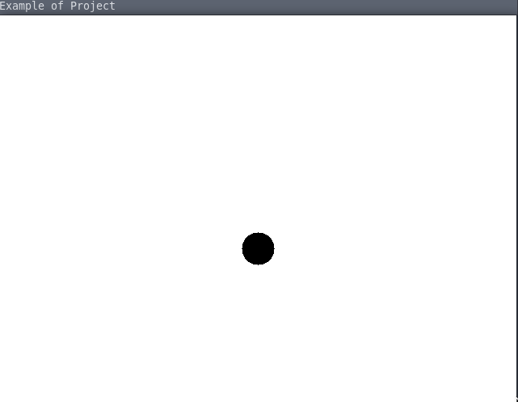

# SDL2 Lua CMake Template

# 1. Introduction
Boilerplate code for small projects that need graphics with easy extendibility. Here it is done with
the `Lua` scripting language. This is also a learning project to look at the capabilities
of a work written in `C/C++` which can be scripted by users or extended with `Lua`.

The underlying graphics library is `SDL2`, which makes the project written in C. 
This is also the chosen language since the `Lua` *VM* has a clean and powerful C API,
which was a language design goal. `Lua` was made to be embedded and further the capabilities of
a language such as `C`. The project would also be maintained by a portable build system like CMake. 

Many thanks for the inspiring work from [here](https://github.com/klassmann/sdl2-lua53-example).



# 2. Dependencies
1. `CMake`
2. `Lua` and its development headers
3. `SDL2`

## 2.1 Debian
```sh
sudo apt-get install build-essential libsdl2-ttf-dev libsdl2-mixer-dev libsdl2-image-dev libsdl2-gfx-dev libsdl2-dev
# TODO
```

## 2.2 Arch
```sh
sudo pacman -S cmake lua sdl2 sdl2_gfx sdl2_image sdl2_mixer sdl2_ttf
```

# 3. Getting Started
1. Build
```sh
cd build
cmake ..
make
```

2. Run
```sh
make run
```
